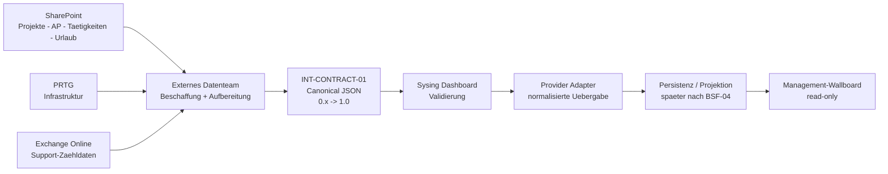
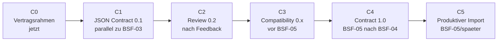

# Operatives Management-Wallboard


_Abbildung 1 - Management-Wallboard nach GF-Feedback. KI-generierte Konzeptvisualisierung mit ChatGPT/OpenAI; Werte sind illustrativ, keine Produktabbildung._

**Status:** IDEA / CONCEPT ONLY - keine Implementierungsfreigabe.

## Management-Entscheidung 0.6.0-draft

Die Datenbeschaffung aus SharePoint, PRTG und Exchange Online soll nach aktuellem Plan durch ein anderes Team erfolgen. Das Sysing Dashboard soll nicht selbst die proprietaere Quellenlogik uebernehmen, sondern eine providerneutrale, versionierte JSON-Importschnittstelle bereitstellen.

Diese Entscheidung ermoeglicht eine fruehe Parallelisierung: Das externe Team kann bereits gegen einen vertraglich beschriebenen JSON-Entwurf entwickeln, waehrend die laufenden BSF-Sprints unveraendert fortgesetzt werden. Die produktive Importimplementierung bleibt weiterhin Teil des spaeteren Integrationspfads.

**Kernaussage fuer das Management:** Wir ziehen keine Implementierung vor. Wir ziehen nur die technische Vertragsgrenze vor.

---

## 1. Management Summary

Die Geschaeftsfuehrung wuenscht fuer einen grossen Monitor im Systemhaus eine dauerhaft aktuelle, schnell erfassbare Managementsicht. Die Sicht soll nicht die operative Detailarbeit ersetzen, sondern innerhalb weniger Sekunden beantworten:

- Wo besteht Handlungsbedarf?
- Welche Bereiche sind stabil?
- Welche Projekte, Arbeitspakete oder Taetigkeiten sind auffaellig?
- Wie ist die aktuelle Infrastruktur-Lage?
- Wie gross ist der Rueckstand im Support-Postfach?
- Wie ist die aggregierte Urlaubs-/Abwesenheitslage?

Die sechs gewuenschten Bereiche bleiben:

| Bereich              | Gewuenschte Darstellung                    | Fachliche Quelle |
| -------------------- | ------------------------------------------ | ---------------- |
| Projekte             | eigene Kachel; Anzahl und Ampelstatus      | SharePoint       |
| Arbeitspakete        | eigene Kachel; Anzahl und Ampelstatus      | SharePoint       |
| Taetigkeiten         | eigene Kachel; Anzahl und Ampelstatus      | SharePoint       |
| Urlaub / Abwesenheit | aggregierte Anzahl diese / naechste Woche  | SharePoint       |
| Infrastruktur        | aggregierte Sensorlage OK/Warnung/Kritisch | PRTG             |
| Support-Postfach     | Anzahl gesamt, heute, gestern, aelter      | Exchange Online  |

Neu ist die Verantwortungsgrenze:

- **Externes Datenteam:** Quellen auslesen, aufbereiten und vereinbartes JSON liefern.
- **Sysing Dashboard:** Vertrag definieren, validieren, sicher importieren/projizieren und darstellen.

Damit entfallen fuer das Sysing Dashboard im ersten Schritt eigene SharePoint-/PRTG-/Exchange-Collector. Das reduziert Kopplung und beschleunigt die parallele Vorbereitung.

---

## 2. Praezisierung gegenueber 0.5.0-draft

| Thema              | 0.5.0-draft                          | 0.6.0-draft                                   | Auswirkung                    |
| ------------------ | ------------------------------------ | --------------------------------------------- | ----------------------------- |
| Datenbeschaffung   | Collector/Provider im Sysing-Konzept | anderes Team liefert Daten                    | klare organisatorische Grenze |
| Integrationsgrenze | quellsystemspezifisch je Provider    | ein versionierter JSON-Vertrag                | geringere Kopplung            |
| Sprintauswirkung   | spaetere Integrationsarbeit          | Contract-Draft darf parallel entstehen        | BSF-03 bleibt unberuehrt      |
| Persistenz         | spaeter zu entscheiden               | weiterhin spaeter zu entscheiden              | BSF-04 bleibt frei            |
| BSF-05             | Canonical Import Model geplant       | INT-CONTRACT-01 bereitet externen Vertrag vor | keine Vorwegnahme der Runtime |
| Wallboard          | Management-UI                        | unveraendert                                  | BSF-07 bleibt Zielpunkt       |

**Architekturprinzip:** Das Datenformat ist frueh definierbar, die produktive Importtechnik bleibt spaeter entscheidbar.

---

## 3. Warum die Vertragsgrenze jetzt vorgezogen werden kann

Der JSON-Vertrag beschreibt **was** geliefert wird, nicht **wie** das Sysing Dashboard es intern speichert.

Deshalb kann der Vertrag vor BSF-04/BSF-05 als Draft entstehen, ohne diese Sprints technisch festzulegen.

Nicht vorweggenommen werden:

- Supabase-Tabellen,
- Azure-SQL-Schema,
- finale Synchronisationsstrategie,
- Konfliktaufloesung,
- finaler Transportweg,
- Authentisierung zwischen den Teams,
- produktiver Import-Endpunkt,
- Retention/Audit-Details.

Dadurch bleibt die bestehende Architekturhoheit erhalten.

---

## 4. Zielarchitektur 0.6.0-draft



_Abbildung 2 - Zielbild der neuen Verantwortungsgrenze. Quellsysteme und Beschaffung liegen ausserhalb der Sysing-UI; die Schnittstelle ist ein versionierter JSON-Vertrag._

### 4.1 Verantwortungsmatrix

| Verantwortungsbereich                         | Externes Datenteam | Sysing Dashboard |
| --------------------------------------------- | :----------------: | :--------------: |
| SharePoint auslesen                           |         X          |        -         |
| PRTG auslesen                                 |         X          |        -         |
| Exchange-Zaehlwerte erzeugen                  |         X          |        -         |
| Quellwerte in Contract-Felder mappen          |         X          |      review      |
| JSON-Syntax/Schema auf Producer-Seite pruefen |         X          |        -         |
| JSON-Vertrag definieren/versionieren          |       review       |        X         |
| Consumer-Validierung                          |         -          |        X         |
| Scope/RBAC/RLS                                |         -          |        X         |
| Persistenz/Projektion                         |         -          |        X         |
| Wallboard-UI                                  |         -          |        X         |
| Produktionsmonitoring                         |     gemeinsam      | X fuer Consumer  |

---

## 5. INT-CONTRACT-01 - parallele Planungsspur

INT-CONTRACT-01 ist **kein neuer Fachsprint**. Es ist eine reine Vertrags-/Dokumentationsspur.

Die verbindliche operative Reihenfolge bleibt unveraendert:

`BSF-03 -> BSF-03D -> BSF-03A -> BSF-03B -> BSF-03E -> BSF-03C -> BSF-DOC -> BSF-04 -> BSF-04A -> BSF-05 -> BSF-06 -> BSF-07 -> ...`

Parallel dazu darf ausschliesslich der externe Vertragsentwurf reifen:



_Abbildung 3 - Reifeweg des Vertrags. Der Entwurf darf parallel entstehen; Runtime und Persistenz bleiben in der regulaeren Sprintfolge._

### 5.1 Nicht-Auswirkungsregel

INT-CONTRACT-01 darf nicht:

- BSF-03 unterbrechen oder umpriorisieren,
- DB/RLS/Grants/Functions aendern,
- Lovable fuer Runtime-Aenderungen ausloesen,
- Supabase als externe Vertragsstruktur festschreiben,
- BSF-04 Persistenzentscheidungen vorwegnehmen,
- BSF-05 als gestartet deklarieren,
- neue Rollen oder Session-Ausnahmen erzeugen,
- produktive Secrets oder Tokens dokumentieren.

---

## 6. Contract Package fuer das andere Team

Geplante Lieferstruktur:

```text
contracts/
  v0.1-draft/
    README.md
    wallboard-management-data.schema.json
    CHANGELOG.md
    examples/
      valid-full-snapshot.json
      valid-partial-source-error.json
      invalid-missing-schema-version.json
```

Diese Artefakte sind maschinenlesbar und pruefbar. Damit kann das andere Team bereits vor einer produktiven Sysing-Importschnittstelle gegen den Vertrag entwickeln.

### 6.1 Zweck der Dateien

| Datei                               | Zweck                                                      |
| ----------------------------------- | ---------------------------------------------------------- |
| README.md                           | fachlicher Vertrag, Verantwortungen, Regeln, offene Punkte |
| JSON Schema                         | automatische Validierung der gelieferten JSON-Struktur     |
| valid-full-snapshot.json            | positives Vollsnapshot-Beispiel                            |
| valid-partial-source-error.json     | Beispiel fuer Teilfehler ohne Gesamtausfall                |
| invalid-missing-schema-version.json | negativer Testfall                                         |
| CHANGELOG.md                        | nachvollziehbare Evolution des Vertrags                    |

---

## 7. JSON-Vertrag 0.1.0-draft

Der erste Draft verwendet einen gemeinsamen Envelope:

```json
{
  "schemaVersion": "0.1.0-draft",
  "deliveryId": "b767cab4-33e2-4e2c-8b2d-f5bc37f6ab10",
  "deliveryType": "snapshot",
  "generatedAt": "2026-09-11T14:00:00Z",
  "observedAt": "2026-09-11T13:59:30Z",
  "producer": {
    "system": "external-management-data",
    "instance": "systemhouse-demo"
  },
  "scope": {
    "systemhouseId": "sh-demo-001"
  },
  "completeness": {
    "snapshotComplete": true,
    "missingDomains": []
  },
  "sourceStatus": [],
  "data": {
    "projects": [],
    "workPackages": [],
    "activities": [],
    "absence": {},
    "infrastructure": {},
    "supportMailbox": {}
  }
}
```

### 7.1 Warum ein gemeinsamer Envelope?

Er erlaubt spaeter:

- eindeutige Versionspruefung,
- Idempotenz ueber `deliveryId`,
- Systemhouse-Scope-Pruefung,
- Freshness-Anzeige,
- Teilfehlerbehandlung,
- reproduzierbare Tests,
- kontrollierte Schema-Evolution.

---

## 8. Snapshot-Semantik

0.1 startet bewusst mit Voll-/Teilsnapshots und nicht mit Delta-Synchronisation.

Regeln:

- `deliveryType = snapshot`,
- `snapshotComplete = true`: alle erwarteten Domaenen sind enthalten,
- `snapshotComplete = false`: eine oder mehrere Domaenen fehlen oder sind nicht belastbar,
- `missingDomains` nennt diese Domaenen explizit,
- fehlende Daten in einem unvollstaendigen Snapshot duerfen **nicht** als Loeschung interpretiert werden.

Delta-Semantik bleibt fuer spaetere Versionen offen.

**Begruendung:** Snapshot-First ist fuer den externen Producer leichter testbar und vermeidet fruehe Festlegungen zu Sequenzen, Konflikten und Wiederholungen.

---

## 9. Freshness und Teilfehler

Jede Quelle meldet ihren Zustand getrennt:

- `ok`,
- `delayed`,
- `stale`,
- `error`.

Zusatzfelder:

- `observedAt`,
- optional `code`,
- optional eine kurze, nicht sensible `message`.

Damit kann das Wallboard beispielsweise Projekte und Support weiterhin anzeigen, obwohl PRTG voruebergehend nicht erreichbar ist.

Das entspricht REQ-009: Ein Teilfehler darf die uebrigen Bereiche nicht unbrauchbar machen.

---

## 10. Fachliche Domaenen

### 10.1 Projekte

Minimaler Draft:

- stabile `sourceId`,
- Titel,
- Status,
- Ampel `green/yellow/red/neutral`,
- `lastChangedAt`.

### 10.2 Arbeitspakete

Zusaetzlich:

- `projectSourceId` als Referenz.

### 10.3 Taetigkeiten

Zusaetzlich:

- `workPackageSourceId` als Referenz.

### 10.4 Urlaub / Abwesenheit

Nur aggregiert:

- `employeesOnLeaveThisWeek`,
- `employeesStartingLeaveNextWeek`,
- `observedAt`.

Keine Namen, Gruende oder Gesundheitsdaten im Wallboard-Vertrag.

### 10.5 Infrastruktur / PRTG

Aggregierte Zaehler:

- OK,
- Warning,
- Critical,
- Total,
- `observedAt`.

### 10.6 Support-Postfach

Nur:

- total,
- today,
- yesterday,
- older,
- `observedAt`.

Nicht Bestandteil:

- Mailbody,
- Betreff,
- Sender,
- Empfaenger,
- LLM-Triage,
- Konfidenzbewertung.

---

## 11. Identitaet und Providerneutralitaet

Das andere Team liefert stabile Quell-IDs, aber **keine internen Datenbank-IDs**.

Beispiele:

- `sourceId`,
- `projectSourceId`,
- `workPackageSourceId`.

Das Sysing Dashboard entscheidet spaeter in BSF-05, wie diese IDs mit kanonischen internen Identitaeten abgeglichen werden.

`scope.systemhouseId` bleibt providerneutral und darf nicht als Microsoft Tenant ID missverstanden werden.

---

## 12. Security und Datenschutz

### 12.1 Payload-Regeln

Der JSON-Vertrag darf nicht enthalten:

- Passwoerter,
- Tokens,
- API Keys,
- Service-Role-Keys,
- produktive Zugangsdaten,
- interne DB-Credentials,
- E-Mail-Inhalte,
- personenbezogene Urlaubsgruende.

### 12.2 Consumer-Sicherheit

Eine erfolgreiche JSON-Schema-Validierung ist **keine** Autorisierung.

Spaetere Runtime muss weiterhin getrennt pruefen:

- Authentisierung,
- Systemhouse-Scope,
- RBAC,
- RLS,
- Importberechtigung,
- Integritaet,
- Audit.

### 12.3 Wallboard-Betrieb

Die bekannte offene Entscheidung bleibt bestehen: Ein dedizierter read-only Wallboard-Account mit abweichender Idle-Session benoetigt einen separaten ADR/Security-Entscheid. INT-CONTRACT-01 aendert daran nichts.

---

## 13. Versionierung und Kompatibilitaet

Geplanter Reifeweg:

| Version | Bedeutung                                                         |
| ------- | ----------------------------------------------------------------- |
| 0.1.x   | erster gemeinsamer Draft                                          |
| 0.2.x   | Feedback des externen Teams                                       |
| 0.x     | Kompatibilitaet, Validierung, Feldschaerfung                      |
| 1.0.0   | erster verbindlicher Produktionsvertrag nach BSF-04/BSF-05 Review |

Grundregeln:

- jede publizierte Schema-Version ist unveraenderlich,
- Aenderungen erzeugen eine neue Version,
- Beispiele werden versionsgebunden gepflegt,
- Breaking Changes duerfen nicht stillschweigend erfolgen,
- produktive Verbraucher muessen `schemaVersion` vor der Verarbeitung pruefen.

---

## 14. Was bewusst offen bleibt

| Thema                        | Warum noch offen                                    |
| ---------------------------- | --------------------------------------------------- |
| Transportmechanismus         | Architektur-/Betriebsentscheidung noch nicht noetig |
| Auth zwischen Teams          | abhaengig von Deploy-/Netzwerkmodell                |
| Payload-Groesse/Batching     | reale Datenmengen noch nicht vermessen              |
| Retry/Acknowledgement        | Teil des spaeteren Runtime-Vertrags                 |
| Delta-Import                 | erst nach Snapshot-Erfahrung und BSF-04             |
| SharePoint-Feldmapping       | muss mit realer Feldliste abgestimmt werden         |
| Urlaubsdefinition Folgewoche | fachliche GF-Entscheidung                           |
| Exchange-Zaehlregel          | Ordner/Zeitgrenzen noch zu bestaetigen              |
| Persistenz                   | BSF-04                                              |
| produktiver Importer         | BSF-05                                              |

Diese offenen Punkte blockieren den Draft nicht.

---

## 15. Nutzen fuer das Management

### 15.1 Frueher Parallelgewinn

Das externe Team kann frueh starten, ohne auf den fertigen Sysing-Importer zu warten.

### 15.2 Klare Verantwortung

Quellenlogik und Dashboardlogik werden organisatorisch und technisch getrennt.

### 15.3 Weniger Integrationsrisiko

Das Sysing Dashboard muss nicht drei proprietaere APIs gleichzeitig beherrschen.

### 15.4 Zukunftssicherheit

Der Vertrag bleibt unabhaengig davon, ob spaeter Supabase, Azure SQL oder andere Persistenz verwendet wird.

### 15.5 Testbarkeit

JSON Schema plus positive und negative Beispiele machen den Vertrag automatisiert pruefbar.

---

## 16. Aufwand der neuen Contract-Spur

Die urspruengliche Aufwandsschaetzung fuer den kompletten Wallboard-Pilot bleibt als Groessenordnung bestehen, muss aber spaeter neu bewertet werden, weil die Datenbeschaffung nun ausserhalb des Sysing Dashboards liegt.

Fuer den vorgezogenen Contract-Track ist der Aufwand wesentlich kleiner:

| Schritt | Ziel                                  |     Schaetzung |
| ------- | ------------------------------------- | -------------: |
| C0      | Vertragsrahmen / Verantwortungsgrenze | ca. 0,5 Prompt |
| C1      | JSON Schema 0.1 + Beispiele + Doku    |    1-2 Prompts |
| C2      | Review nach externem Feedback         |   ca. 1 Prompt |
| C3      | Compatibility / Evolution             |   ca. 1 Prompt |
| C4      | 1.0-Abgleich in BSF-05                |   ca. 1 Prompt |

Diese Werte sind Planungswerte, keine Festpreise.

---

## 17. Einordnung in Backlog und Sprints

INT-CONTRACT-01 wird als **parallele Vertragsvorbereitung** dokumentiert.

Es aendert die Reihenfolge der Fachsprints nicht.

Der spaetere Zusammenhang ist:

```text
INT-CONTRACT-01 0.x  -----\
                         +--> BSF-05 Canonical Import Model / Contract 1.0 --> produktiver Import
BSF-04 Datenstrategie ---/

produktive Datenprojektion --> BSF-07 Managementcockpit 2 / Wallboard
```

Das Wallboard bleibt fachlich unter BSF-07 verortet. Die produktive Import-/Integrationsfaehigkeit entsteht im BSF-05-/Integration-Readiness-Pfad.

---

## 18. Empfohlene naechste Schritte

1. Draft 0.1 intern fachlich und technisch pruefen.
2. JSON-Schema und Beispiele gegen einen Validator testen.
3. Externes Datenteam mit 0.1-Draft versorgen.
4. Rueckfragen und Feldmapping in 0.2 aufnehmen.
5. Keine produktive Transport-/DB-Implementierung vorziehen.
6. Vor BSF-05 Compatibility-Regeln stabilisieren.
7. In BSF-05 nach BSF-04 den Vertrag auf 1.0 heben.

---

## 19. Abnahmekriterien fuer INT-CONTRACT-01 C1

- Contract-Package dokumentiert.
- JSON Schema syntaktisch gueltig.
- Vollsnapshot-Beispiel validiert.
- Teilfehler-Beispiel validiert.
- Negativbeispiel wird abgewiesen.
- keine produktiven Secrets oder personenbezogenen Mail-/Urlaubsdetails.
- keine internen DB-Tabellennamen im externen Vertrag.
- keine Aenderung an DB/RLS/Grants/Functions.
- keine Aenderung der aktiven Sprintreihenfolge.
- Issue #123 und Draft PR #124 verweisen auf den neuen Vertragsstrang.

---

## 20. TDF-Abschlusscheck 0.6.0-draft

| Pruefpunkt                 | Status        | Nachweis / Bemerkung                                            |
| -------------------------- | ------------- | --------------------------------------------------------------- |
| Zweck, Zielgruppe, Scope   | PASS          | Management-Wallboard und externe Datenlieferung klar abgegrenzt |
| GF-Feedback                | PASS          | sechs Managementbereiche unveraendert                           |
| neue Teamgrenze            | PASS          | externes Team = Datenbeschaffung; Sysing = Vertrag/Import/UI    |
| Ist / Plan / Idee          | PASS          | IDEA ONLY, kein produktiver Import freigegeben                  |
| bestehende Sprintfolge     | PASS          | unveraendert; INT-CONTRACT-01 nur parallel als Doku/Vertrag     |
| Providerneutralitaet       | PASS          | keine Supabase-Tabellen im externen Vertrag                     |
| BSF-04 Schutz              | PASS          | Persistenz-/Synchronisationsstrategie bleibt offen              |
| BSF-05 Schutz              | PASS          | Runtime-Importer nicht vorgezogen                               |
| Security / Least Privilege | PASS mit OPEN | Runtime-Auth/Transport spaeter; keine Secrets im Payload        |
| Datenschutz                | PASS mit OPEN | Mail nur Zaehler; Urlaub nur aggregiert                         |
| Teilfehler/Freshness       | PASS          | sourceStatus + incomplete snapshot vorgesehen                   |
| Versionierung              | PASS          | Contract-Reifeweg 0.x -> 1.0 dokumentiert                       |
| Testbarkeit                | PASS          | JSON Schema + positive/negative Beispiele vorgesehen            |
| Visuelle Kommunikation     | PASS          | Management-Hero + Mermaid-Architektur + Reifeweg                |
| Dokumentation/Traceability | PASS          | Issue #123, PR #124, INT-CONTRACT-01                            |

**TDF-Gesamtergebnis:** PASS MIT OFFENEN RUNTIME-/TRANSPORT-/SECURITY-ENTSCHEIDUNGEN. Der Contract-Draft kann parallel weiterentwickelt werden, ohne die aktive Produktentwicklung umzustellen.

---

## 21. Quellen und Traceability

| Quelle                                          | Verwendung                                                     |
| ----------------------------------------------- | -------------------------------------------------------------- |
| TDF Operatives Management-Wallboard 0.5.0-draft | Ausgangskonzept                                                |
| GF-Feedback 11.09.2026                          | getrennte Projekte/AP/Taetigkeiten, Urlaub, reine Mail-Zaehler |
| GitHub Issue #123                               | Ideenspeicher / Scope                                          |
| Draft PR #124                                   | Dokumentationsbranch                                           |
| GESAMTPLAN-SYSING-DASHBOARD.md                  | strategische Sprintfolge                                       |
| SPRINT-PLAN-MVP-BSF.md                          | operative Sprintfolge / Nicht-Unterbrechungsregel              |
| INT-CONTRACT-01 v0.1-draft                      | externer JSON-Vertragsentwurf                                  |

---

## 22. Versionshistorie

| Version         | Datum          | Aenderung                                                                                                                                                           | AI-Unterstuetzung                                              |
| --------------- | -------------- | ------------------------------------------------------------------------------------------------------------------------------------------------------------------- | -------------------------------------------------------------- |
| 0.1 historisch  | 11.09.2026     | erstes Wallboard-Konzept                                                                                                                                            | Ja - ChatGPT/OpenAI                                            |
| 0.2 historisch  | 11.09.2026     | TDF-Managementfassung, Betriebsart, Aufwand                                                                                                                         | Ja - ChatGPT/OpenAI                                            |
| 0.3 historisch  | 11.09.2026     | GF-Feedback: getrennte Ebenen, Urlaub, reduzierte Mail-Sicht                                                                                                        | Ja - ChatGPT/OpenAI                                            |
| 0.4 historisch  | 11.09.2026     | Visualisierung und Simplicity-Test geschaerft                                                                                                                       | Ja - ChatGPT/OpenAI                                            |
| 0.5.0-draft     | 11.09.2026     | TDF-SemVer, A11y-/Layout-Check, konsolidierte Managementfassung                                                                                                     | Ja - ChatGPT/OpenAI                                            |
| **0.6.0-draft** | **11.09.2026** | **externes Datenteam, providerneutraler JSON-Vertrag, INT-CONTRACT-01, Contract-Package, Snapshot-/Freshness-/Teilfehler-Semantik und Backlog-Einordnung ergaenzt** | **Ja - ChatGPT/OpenAI; fachlich durch Bernd Marnau gesteuert** |
