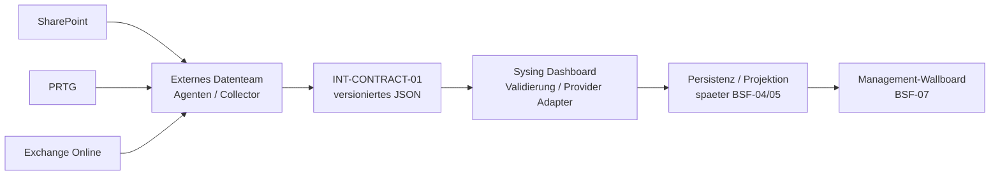

# Operatives Management-Wallboard


_Abbildung 1 - Management-Wallboard-Zielbild. Werte sind illustrativ; keine Produktabbildung._

**Status:** IDEA / CONCEPT ONLY - keine Implementierungsfreigabe.

## 1. Management Summary

Die Geschaeftsfuehrung soll auf einem grossen Monitor eine dauerhaft aktuelle, schnell erfassbare Lageuebersicht erhalten. Das Sysing Dashboard bleibt dafuer die zentrale Plattform. Die Daten aus SharePoint, PRTG und Exchange Online werden nach aktueller Planung durch ein anderes Team beschafft und ueber einen providerneutralen, versionierten JSON-Vertrag bereitgestellt.

Die wesentliche Managemententscheidung in Version `0.7.0-draft` lautet daher:

> Wir ziehen nicht die produktive Integration vor. Wir ziehen nur die technische Vertragsgrenze vor, damit das externe Datenteam parallel arbeiten kann.

Damit bleibt die aktive BSF-Sprintreihenfolge unveraendert. BSF-03 wird nicht unterbrochen. BSF-04 bleibt fuer Persistenz- und Synchronisationsstrategie fuehrend. BSF-05 bleibt fuer Canonical Import Model und produktiven Import fuehrend. BSF-07 bleibt der fachliche Zielpunkt fuer das Management-Wallboard.

## 2. Managementbereiche

| Bereich | Managementanzeige | Datenquelle |
| --- | --- | --- |
| Projekte | Anzahl, Status, Ampellage | SharePoint |
| Arbeitspakete | Anzahl, Status, Ampellage | SharePoint |
| Taetigkeiten | offene/auffaellige Taetigkeiten und Status | SharePoint |
| Urlaub / Abwesenheit | nur aggregierte Anzahl fuer diese und naechste Woche | SharePoint |
| Infrastruktur | aggregierte Sensorlage OK / Warnung / Kritisch | PRTG |
| Support-Postfach | nur Mengenwerte gesamt / heute / gestern / aelter | Exchange Online |

Nicht Bestandteil des Pilotvertrags sind Mailinhalte, Betreff, Absender, Empfaenger, Urlaubsgruende, Diagnosen oder personenbezogene Leistungsbewertungen.

## 3. Zielbild und Verantwortungsgrenze



### 3.1 Externes Datenteam

Das externe Team verantwortet:

- lesenden Zugriff auf die vereinbarten Quellen,
- Beschaffung und deterministische Aufbereitung,
- stabile Source-IDs und nachvollziehbare Referenzen,
- korrekte Zeitstempel und Source-Status,
- Mapping-Dokumentation und Datenqualitaet auf Producer-Seite,
- JSON-Schema-Validierung vor Auslieferung,
- nachvollziehbare Fehler- und Teilfehlerkennzeichnung,
- Testlieferungen und Abnahmenachweise.

### 3.2 Sysing Dashboard

Das Sysing-Team verantwortet:

- Definition und Versionierung des externen Vertrags,
- Consumer-seitige Schema- und Scope-Validierung,
- spaeteren Provider Adapter,
- Persistenz/Projektion nach BSF-04/05,
- RBAC, RLS und Least Privilege,
- Freshness- und Teilfehlerbehandlung,
- Managementdarstellung und spaeteres Monitoring.

## 4. INT-CONTRACT-01 als parallele Vertragsvorbereitung

Der technische Liefervertrag besitzt einen eigenen Versionszyklus. Aktueller Draft ist `0.1.0-draft`.

Das Contract Package umfasst:

- `wallboard-management-data.schema.json`,
- Contract-README,
- Feldkatalog,
- Validierungsregeln,
- Anforderungen an das externe Datenteam,
- positive und negative Beispielpayloads,
- Contract-Changelog.

Die Vertragsspur ist Dokumentation und Spezifikation, kein neuer Fachsprint.

## 5. Warum providerneutral?

Die externe Teamgrenze beschreibt **was** geliefert wird, nicht **wie** das Sysing Dashboard die Daten intern speichert. Deshalb enthaelt der Vertrag keine Verpflichtung auf Supabase-Tabellen, Azure-SQL-Tabellen oder Lovable-spezifische Laufzeitlogik.

Dadurch bleibt die Architektur offen fuer:

- Supabase im MVP,
- spaetere Azure-SQL- oder Azure-Storage-Provider,
- Entra-ID-Integration,
- Docker-/On-Prem-Betrieb,
- weitere Datenquellen ohne Neudesign der UI.

## 6. Snapshot-, Freshness- und Teilfehlerprinzip

Contract `0.1.0-draft` startet bewusst mit Snapshots.

- `snapshotComplete = true`: alle erwarteten Domaenen sind vorhanden.
- `snapshotComplete = false`: mindestens eine Domaene fehlt oder ist nicht belastbar.
- `missingDomains` nennt die betroffenen Bereiche.
- fehlende Daten eines unvollstaendigen Snapshots duerfen nicht als Loeschung interpretiert werden.
- jede Quelle liefert `observedAt` und einen Source-Status.

Ein Fehler in PRTG darf zum Beispiel nicht verhindern, dass Projekte und Support-Postfach weiter angezeigt werden.

## 7. Lieferqualitaet des externen Datenteams - Managementsicht

Die detaillierten technischen Anforderungen stehen im separaten Contract-Dokument `INT-CONTRACT-01 / Anforderungen an das externe Datenteam`, Version `0.1.0-draft`.

Fuer das Management gelten insbesondere diese Steuerungsleitplanken:

| Steuerungsdimension | Managementziel | Technischer Nachweis |
| --- | --- | --- |
| Vollstaendigkeit | entscheidungsrelevante Daten fehlen nicht stillschweigend | Schema + `snapshotComplete` / `missingDomains` |
| Korrektheit | keine erfundenen oder kreativ interpretierten Werte | deterministische Mapping-Regeln + Producer-Tests |
| Aktualitaet | jede Quelle ist zeitlich einordenbar | `observedAt` + Source-Status + Freshness-SLO |
| Datenschutz | nur fuer das Wallboard erforderliche Informationen | keine Mailinhalte, Urlaub nur aggregiert, keine Secrets |
| Betrieb | Teilfehler machen nicht das gesamte Managementbild unbrauchbar | per-source Fehlerstatus + Teilsnapshot-Semantik |

Ziel fuer angenommene Lieferungen ist 100 % Schema-Gueltigkeit und 100 % Pflichtfeldabdeckung. Fuer verbotene sensible Inhalte, unmarkierte Teilfehler und erfundene/geschaetzte Werte gilt 0-%-Toleranz.

## 8. Agentenbegriff

Im Pilot bezeichnet `Agent` primaer einen deterministischen Read-Collector. Ein LLM ist fuer Contract `0.1.0-draft` nicht erforderlich.

Generative KI darf spaeter nur dann beteiligt werden, wenn jeder gelieferte Wert weiterhin auf reale Quelldaten oder eine dokumentierte deterministische Aggregation zurueckgefuehrt werden kann. KI darf fehlende Daten nicht erfinden oder ungeprueft vervollstaendigen.

## 9. Einordnung in Backlog und Sprints

Die Produktreihenfolge bleibt unveraendert:

```text
BSF-03 -> 03D -> 03A -> 03B -> 03E -> 03C -> DOC
       -> BSF-04 -> 04A -> BSF-05 -> BSF-06 -> BSF-07 -> ...
```

Parallel darf ausschliesslich die Contract-Spur weiterreifen:

```text
INT-CONTRACT-01 0.x ---------\
                                  +--> BSF-05 Contract 1.0 / Importer
BSF-04 Datenstrategie --------/

produktive Projektion ----------------> BSF-07 Management-Wallboard
```

## 10. Reifeweg

| Stufe | Zeitpunkt | Ergebnis |
| --- | --- | --- |
| C0 | jetzt | Scope, Verantwortungsgrenze, Nicht-Auswirkungsregeln |
| C1 | parallel zu BSF-03 | JSON Schema 0.1, Beispiele, Producer-Anforderungen |
| C2 | nach Feedback des Datenteams | Feld-/Semantikreview, Contract 0.2 |
| C3 | vor BSF-05 | Kompatibilitaet, Idempotenz, Evolution stabilisieren |
| C4 | BSF-05 nach BSF-04 | verbindlicher Contract 1.0-Kandidat |
| C5 | BSF-05/spaeter | produktiver Transport, Importer, Monitoring |

## 11. Was bewusst offen bleibt

- produktiver Transportmechanismus,
- Authentisierung zwischen Producer und Consumer,
- Payload-Groesse und Batching,
- Acknowledgement-/Retry-Protokoll,
- Delta-Semantik,
- finale SharePoint-Feld-/Statusabbildung,
- genaue Urlaubsdefinition fuer die Folgewoche,
- PRTG-Scope und Sonderzustaende,
- Exchange-Zaehllogik und Tagesgrenzen,
- finale Freshness-SLOs,
- Persistenz-/Konfliktstrategie.

Diese Punkte werden bewusst nicht vor BSF-04/05 festgeschrieben.

## 12. Risiken und Gegenmassnahmen

| Risiko | Wirkung | Gegenmassnahme |
| --- | --- | --- |
| Vertrag koppelt sich an Supabase | spaetere Migration wird schwer | externer Vertrag bleibt providerneutral |
| Datenteam interpretiert Werte frei | Managementzahlen nicht belastbar | Mapping-Regeln, Provenienz und Producer-Tests |
| Quelle faellt aus | Wallboard wirkt leer oder falsch | Source-Status, Freshness, Teilsnapshot |
| sensible Daten gelangen ins Wallboard | Datenschutz-/IS-Risiko | strikte Datenminimierung und 0-%-Toleranz |
| Contract-Track stoert BSF-03 | Prioritaetsverlust | keine Runtime-/DB-/RLS-Aenderungen in INT-CONTRACT-01 |

## 13. TDF-Abschlusscheck 0.7.0-draft

| Pruefpunkt | Status |
| --- | --- |
| Zweck, Zielgruppe, Scope | PASS |
| Managementnutzen | PASS |
| Verantwortungsgrenze | PASS |
| Providerneutralitaet | PASS |
| Nicht-Auswirkung auf BSF-03/04/05 | PASS |
| Security-/Datenschutzleitplanken | PASS mit spaeteren Runtime-Entscheidungen |
| Datenqualitaetsziele | PASS |
| Versionierung getrennt/nachvollziehbar | PASS |
| Testbarkeit | PASS geplant ueber Schema + Beispiele |
| Produktive Implementierung freigegeben | NEIN |

**TDF-Gesamtergebnis:** PLANUNGS-/VERTRAGSDRAFT IST KONSISTENT. Keine Freigabe fuer produktive Integration.

## 14. Quellen und Traceability

| Quelle | Verwendung |
| --- | --- |
| TDF Management-Wallboard `0.6.0-draft` | unmittelbare Vorversion |
| GitHub Issue #123 | Wallboard-Idee / fachlicher Scope |
| GitHub Issue #125 | INT-CONTRACT-01 / externe Datenlieferung |
| Draft PR #124 | Dokumentations- und Contract-Branch |
| `GESAMTPLAN-SYSING-DASHBOARD.md` | strategische Sprintfolge |
| `SPRINT-PLAN-MVP-BSF.md` | operative Nicht-Unterbrechungsregel |
| INT-CONTRACT-01 `0.1.0-draft` | technischer JSON- und Producer-Vertrag |

## 15. Versionshistorie

| Version | Datum | Aenderung |
| --- | --- | --- |
| 0.5.0-draft | 11.09.2026 | konsolidierte TDF-Managementfassung |
| 0.6.0-draft | 11.09.2026 | externes Datenteam, JSON-Vertragsgrenze, Contract-Package, Snapshot/Freshness/Teilfehler |
| **0.7.0-draft** | **11.09.2026** | **separate technische Lieferanforderung 0.1.0-draft, messbare Datenqualitaetsziele und Management-Steuerungsleitplanken** |

_AI-Transparenz: Inhalt, Struktur und Visualisierung wurden mit ChatGPT/OpenAI unter fachlicher Steuerung durch Bernd Marnau erstellt. KI-generierte Abbildungen sind Konzeptdarstellungen und keine Produktabbildungen._
