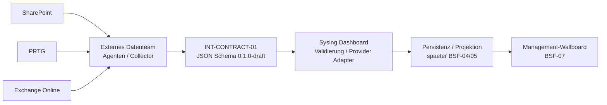

# Operatives Management-Wallboard


**Status:** IDEA / CONCEPT ONLY - keine Implementierungsfreigabe.

## 1. Management Summary

Die Geschaeftsfuehrung soll auf einem grossen Monitor eine dauerhaft aktuelle, schnell erfassbare Lageuebersicht erhalten. Das Sysing Dashboard bleibt die zentrale Plattform. Die Daten aus SharePoint, PRTG und Exchange Online werden nach aktueller Planung durch ein anderes Team beschafft und ueber einen providerneutralen, versionierten JSON-Vertrag bereitgestellt.

Die wesentliche Entscheidung lautet:

> Wir ziehen nicht die produktive Integration vor. Wir ziehen nur die technische Vertragsgrenze vor, damit das externe Datenteam parallel arbeiten kann.

Die aktive BSF-Sprintreihenfolge bleibt unveraendert. BSF-03 wird nicht unterbrochen. BSF-04 bleibt fuer Persistenz/Synchronisation fuehrend, BSF-05 fuer Canonical Import Model und produktiven Import, BSF-07 fuer das Management-Wallboard.

## 2. Managementbereiche

| Bereich | Managementanzeige | Quelle |
| --- | --- | --- |
| Projekte | Anzahl, Status, Ampellage | SharePoint |
| Arbeitspakete | Anzahl, Status, Ampellage | SharePoint |
| Taetigkeiten | offene/auffaellige Taetigkeiten und Status | SharePoint |
| Urlaub / Abwesenheit | nur aggregierte Anzahl fuer diese und naechste Woche | SharePoint |
| Infrastruktur | aggregierte Sensorlage OK / Warnung / Kritisch | PRTG |
| Support-Postfach | nur Mengenwerte gesamt / heute / gestern / aelter | Exchange Online |

Mailinhalte, Betreff, Absender, Empfaenger, Urlaubsgruende, Diagnosen und personenbezogene Leistungsbewertungen sind nicht Bestandteil des Wallboard-Vertrags.

## 3. Verantwortungsgrenze



Das externe Team verantwortet Quellzugriff, deterministische Aufbereitung, stabile Source-IDs, Zeitstempel, Source-Status, Mapping/Provenienz, Producer-Validierung und Testlieferungen. Das Sysing Dashboard verantwortet Vertrag/Versionierung, Consumer-Validierung, spaeteren Provider Adapter, Persistenz/Projektion, RBAC/RLS und Darstellung.

## 4. Contract-Spur

INT-CONTRACT-01 ist eine parallele Vertrags- und Dokumentationsspur, kein neuer Fachsprint. Aktueller Stand:

- JSON Schema / Contract Package: `0.1.0-draft`.
- Producer-Anforderung: `0.1.1-draft`.
- Managementdokument: `0.7.1-draft`.

Der Patch `0.7.1-draft` entstand im TDF-Abschlusscheck. Er korrigiert Accessibility-/Dokumentmetadaten und aendert keine fachliche Runtime-, DB-, RLS- oder Contract-Schema-Semantik.

## 5. Providerneutralitaet

Die externe Teamgrenze beschreibt **was** geliefert wird, nicht **wie** Sysing intern speichert. Der Vertrag ist nicht an Supabase-, Azure-SQL- oder Lovable-spezifische Tabellen/Laufzeitlogik gekoppelt und schuetzt damit die spaetere Azure-/Entra-/Docker-Portabilitaet.

## 6. Snapshot, Freshness und Teilfehler

- Contract `0.1.0-draft` startet mit Snapshots.
- `snapshotComplete = true` bedeutet: alle erwarteten Domaenen vorhanden.
- `snapshotComplete = false` bedeutet: mindestens eine Domaene fehlt oder ist nicht belastbar.
- `missingDomains` nennt die betroffenen Bereiche.
- fehlende Daten eines unvollstaendigen Snapshots sind keine Loeschung.
- jede Quelle liefert `observedAt` und `sourceStatus`.

## 7. Lieferqualitaet - Managementsicht

| Dimension | Ziel | Nachweis |
| --- | --- | --- |
| Vollstaendigkeit | keine still fehlenden Managementdaten | Schema + Completeness-Metadaten |
| Korrektheit | keine erfundenen oder frei interpretierten Werte | Mapping + Producer-Tests |
| Aktualitaet | Datenalter sichtbar und bewertbar | `observedAt` + Freshness-SLO |
| Datenschutz | nur erforderliche Managementdaten | Mail nur Zaehler; Urlaub nur Aggregat; keine Secrets |
| Betrieb | Teilfehler bleiben lokal sichtbar | per-source Status + Teilsnapshot |

Fuer angenommene Lieferungen gelten im Draft 100 % Schema-Gueltigkeit und Pflichtfeldabdeckung. Fuer verbotene sensible Inhalte, unmarkierte Teilfehler und erfundene/geschaetzte Werte gilt 0-%-Toleranz.

## 8. Agentenbegriff

Im Pilot bezeichnet `Agent` primaer einen deterministischen Read-Collector. Ein LLM ist fuer Contract `0.1.0-draft` nicht erforderlich. Generative KI darf fehlende Daten nicht erfinden oder ungeprueft vervollstaendigen.

## 9. Backlog und Reifeweg

```text
INT-CONTRACT-01 0.x ---------\
                                  +--> BSF-05 Contract 1.0 / Importer
BSF-04 Datenstrategie --------/

produktive Projektion ----------------> BSF-07 Management-Wallboard
```

| Stufe | Zeitpunkt | Ergebnis |
| --- | --- | --- |
| C0 | jetzt | Scope, Verantwortungsgrenze, Nicht-Auswirkungsregeln |
| C1 | parallel zu BSF-03 | Schema 0.1, Beispiele, Producer-Anforderungen |
| C2 | nach externem Feedback | reales Feld-/Semantik-/Freshness-Review |
| C3 | vor BSF-05 | Compatibility, Idempotenz, Evolution |
| C4 | BSF-05 nach BSF-04 | Contract 1.0-Kandidat |
| C5 | BSF-05/spaeter | produktiver Import/Transport/Monitoring |

## 10. Bewusst offene Entscheidungen

Transport, Authentisierung, Payload-Groesse/Batching, Acknowledgement/Retry, Delta-Semantik, finale SharePoint-/PRTG-/Exchange-Mappings, finale Freshness-SLOs und Persistenz-/Konfliktstrategie bleiben bewusst fuer C2 beziehungsweise BSF-04/05 offen.

## 11. TDF-Abschlusscheck 0.7.1-draft

| Pruefpunkt | Status | Nachweis |
| --- | --- | --- |
| Zweck / Zielgruppe / Scope | PASS | Management-Wallboard und externe Lieferung klar abgegrenzt |
| Verantwortungsgrenze | PASS | extern = Beschaffung; Sysing = Vertrag/Import/UI |
| Providerneutralitaet | PASS | keine internen DB-Tabellen im externen Vertrag |
| Nicht-Auswirkung BSF-03/04/05 | PASS | keine Runtime-/DB-/RLS-Aenderung |
| Security / Datenschutz | PASS mit OPEN | Transport/Auth spaeter; Datenminimierung dokumentiert |
| Freshness / Teilfehler | PASS | sourceStatus + incomplete snapshot |
| Versionierung | PASS | Management 0.7.1, Producer-Doku 0.1.1, Schema 0.1.0 getrennt |
| Testbarkeit | PASS | Schema + Vollsnapshot + Teilfehler PASS; Negativfall erwartungsgemaess FAIL |
| Accessibility | PASS | DOCX-Audit 0 High / 0 Medium / 0 Low |
| PDF/Layout | PASS | 15 Seiten, keine leeren Seiten, keine Clipping-/Overlap-Findings |
| Traceability | PASS | #123, #125, Draft PR #124, separater TDF-Check |

**TDF-Gesamtergebnis:** PASS MIT BEWUSST OFFENEN RUNTIME-/TRANSPORT-/SECURITY-ENTSCHEIDUNGEN. Keine produktive Implementierungsfreigabe.

## 12. Versionshistorie

| Version | Datum | Aenderung |
| --- | --- | --- |
| 0.5.0-draft | 11.09.2026 | konsolidierte TDF-Managementfassung |
| 0.6.0-draft | 11.09.2026 | externes Datenteam, JSON-Vertragsgrenze, Snapshot/Freshness/Teilfehler |
| 0.7.0-draft | 11.09.2026 | separate technische Lieferanforderung und messbare Datenqualitaetsziele |
| **0.7.1-draft** | **11.09.2026** | **TDF-Abschlusscheck: Accessibility-/Tabellenmetadaten korrigiert und reale Schema-/Beispielvalidierung nachgewiesen; keine fachliche Contract-Aenderung** |

Detaillierter Nachweis: `TDF-CHECK-2026-09-11.md`.

_AI-Transparenz: Inhalt, Struktur und Visualisierung wurden mit ChatGPT/OpenAI unter fachlicher Steuerung durch Bernd Marnau erstellt. KI-generierte Abbildungen sind Konzeptdarstellungen und keine Produktabbildungen._
